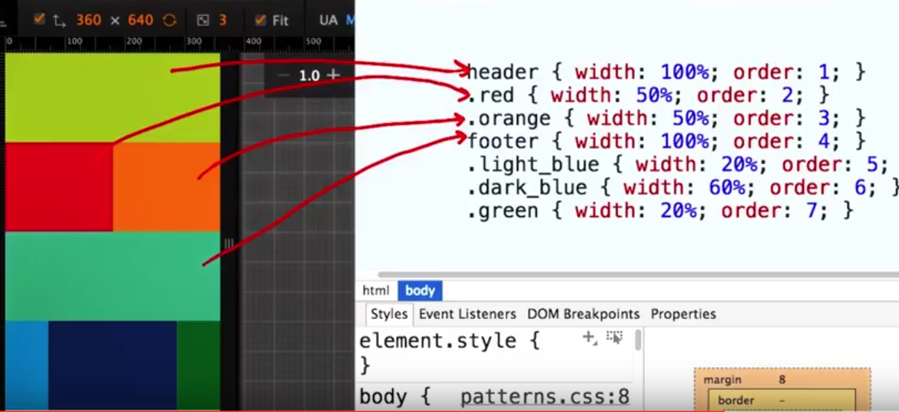

## Project 1 - Movie Trailer

### SimpleHTTPServer
- python -m SimpleHTTPServer 8080 to create a local server on your maching
- http://localhost:8080 to access the index.html
### twilio
Check to make sure that you don't have a file named twilio.py; Python will try to load the Twilio library from your twilio.py file instead of from the Twilio library.

### packages
- predawn: appearance
- SublimeCodeintel: hit dot can see the function
- Emmet: div.myClass -> 
- JSCS - linter for js and css  
- colorhighlighter
- autofilename


### Moive Trailer
- Class
- Self
- Instance Variables
- Instance methods
- Class Varibales - the variable that share by all instance of a class, which is not defined in __init__
- Method overiding


## Tmux
- Session > Window > Pane
- Tmuc ls  (list the session that is run on your computer)
- Tmux attach-session -t 0
- Tmux kill-session -t SessionName
- Tmux deattach (ctrl+b D)
- ctrl+b %
- ctrl+b "
- ctrl+b arrow  (switch between between panes)
- ctrl+b c (create new window)
- ctrl+b n   ctrl+b p   (swich between windows)
- tmux new -s "Udacity" (create new session)
- ctrl+b (  ctrl+b )     (switch between session) 

### mouse mode
- ctrl+b m   (mouse on)

### pair programming


## Project 2 - Portfolio

### HTML
- all elements are rectangular
- you can read the same text as on the page
- Tree Like Structure
- Search engine use headings to index the structure and content of the page.

**HTML** - HyperText Markup Language - the standard markup language used to create web pages.

**CSS** - Cascading Style Sheets - style sheet language used for describing the look and formatting of a document written in a markup language.

**DOM** - Document Object Model - a cross-platform and language-independent convention for representing and interacting with objects in HTML (and other markup languages). The nodes of every document are organized in a tree structure, called the DOM tree.

### The Box Model
**content**
**padding**
affected by background color property
**border**
affected by color property
**Margin**
transparent (space between boxes)

__box-sizing__ - when set width or height it will consider not only the content but also padding and border
-webkit-box-sizing: border-box;<br>
-moz-box-sizing: border-box;<br>
-ms-box-sizing: border-box;<br>
box-sizing: border-box

__flex box layout__ - horizontal layout not vertical
display: flex;

### Code, Test, Refine
- Look for natural boxes. (divide and conquer)
- Look for repeated styles & semantic elements
- write your html 
- Apply styles (from Biggest to smallest)
- Fix things(in diff browser; resize the windows)

### Grid based design 
- responsive design - fit in different resolution
- use media queries to change css property depending on device, screen size and color in css
```css
@media only screen and (max-width: 500px){
    p{
        display: none;
    }
}
```

**semantic tags include:**

- <h1> - <h4>
- 
- <form>

**place hold **
- placehold.it (src="http://placehold.it/960x350")
- placepuppy.it(src="http://placepuppy.it/1000/350") //not work

- placekitten.com(src="http://placekitten.com/1000/350")
**font**
- google font


### bootstrap
Boostrap is big. But we can customize what we need.
<a href="getbootstap.com/customize/">customize bootstrap link</a>

* Typography
* Grid System
* Modals

* container -> row -> col -> content
* data-toggle="modal" data-target="#project1"

## Responsive Site
__Hardware Pixels(HP) vs Device Indepedent Pixels(DIP)__**__

* HP: 1920x1080 px
* device pixel ratio(DPR) = HP/DIP; two HD one DIP
* viewport width(css pixel) = HP / DPR

**reasons that could cause a page looks different on the same device**
* The DPR differs
* The veiwport wasn't set.

__code__

* <meta name="viewport" content="width=device-width,initail-scale=1">
>the code make css_pixel/DIP = 1

??
* What is DIP? What is CSS pixel
* recommend to set a max-width
```css

img,embed,object,video{
    max-width: 100%;
}
/*the size of our figure is about 48px*/
nav a, button{
    min-width :48px;
    min-height: 48px;
}
```

__tips__
* start to design the smallest viewport site first (phone)
* code and desing from small to large - performance matter

### Media Query
```html
<!-- link -->
<link rel="stylesheet" href="style.css">
<link rel="stylesheet" media="screen and (min-width:500px)" href="over500.css">
```

```css
<!-- embed 1-->
@media screen and (min-width:500px){
    body{background-color: green;}
}
<!-- embed 2 (not recommended for performance reason -->
@import url("no.css") only screen and (min-width:500px); 

@media screen and (max-width:400px){
    body{
        background-color: red;        
    }
}


@media screen and (min-width:400px) and (max-width:600px){
    body{
        background-color: green;
    }
}


@media screen and (min-width:600px){
    body{
        background-color: blue;
    }
}
```
 

 __most frequently used attrs__
 
 size of window
 
 * min-width (width > some value apply)
 * max-width (width < some value then apply)


__break points (the points where the css changes)__

* How to choose break points - __always based on content, content first then breakpoint__
    - First, design the site based on the smallest device
    - Second, drag to increase the screen size and find point where the content no longer look good, add break point to accommondate the wider width
* small -> medium: vertical layout -> horizontal layout
* medium -> large: horizontal -> add margin

```css
@media screen and (max-width:400px){}
@media screen and (min-width: 401px) and (max-width: 600px){}
```

__Pattern - Grid Fluid System__

1 on container

```css
display: flex;
flex-wrap: wrap;
```
2 responsive order change

```css
@media screen and (min-width:700px){
    .dark_blue{order: 4;}
    .green{order:1;}
    .red{order:2;}
    .orange{order:3;}
}
```
default order is: 0




__more media query examples__

```css
@media tv and (min-width: 700px) and (orientation: landscape) {}

Orientation
<!-- When using a comma-separated list of media queries, if any of the media queries returns true, the styles or style sheets get applied.  -->
@media (min-width: 700px), handheld and (orientation: landscape) { }

NOT
@media not screen and (color), print and (color) {}
It is evaluated like this:
@media (not (screen and (color))), print and (color) {}

only - The only keyword prevents older browsers that do not support media queries with media features from applying the given styles:
<link rel="stylesheet" media="only screen and (color)" href="example.css" />
```

<a href="https://developer.mozilla.org/en-US/docs/Web/CSS/Media_Queries/Using_media_queries">MDN Media Query</a>


### 4 design pattern

<a href="https://developers.google.com/web/fundamentals/design-and-ui/responsive/patterns">four pattern google explanations</a>

* Most Fluid


* Column Drop


* Layout Shifer
    - change order at break point
    - use clustered container to group two div


* Off Canvas


* flex-grow:1 // take up 1 proportion of the space
* flex-flow = flew-direction + flex-wrap
    - flex-flow: row nowrap
    - flex-flow: row-reverse wrap

<a href="https://css-tricks.com/snippets/css/a-guide-to-flexbox/">A complete guide to flexbox</a>


### Other Optimizations

__tables__

* Hidden Colums
    - media query + display:none
* No more tables
    - 
* Contained tables
    - media query + td{display:block;} + td:before{content: attr(data-th)}

65 cpl is good for reading

__suggestion__

* font-size: 16px; line-height: 1.2em;
* font-size: 18px; line-height: 1.25em;
__miner breakpoint__

* ajust: 1. font-size 2. icon-size 3. line content 
* 
