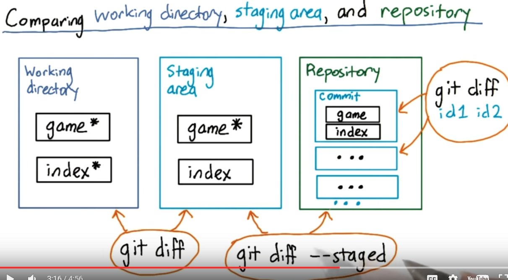
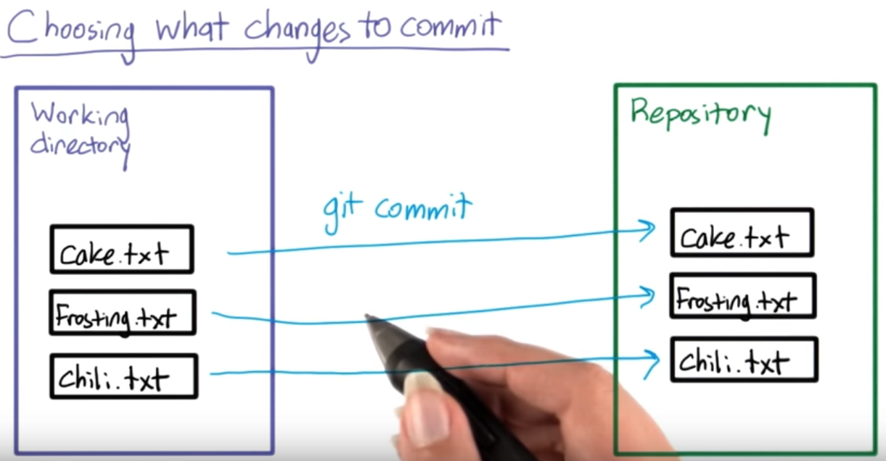
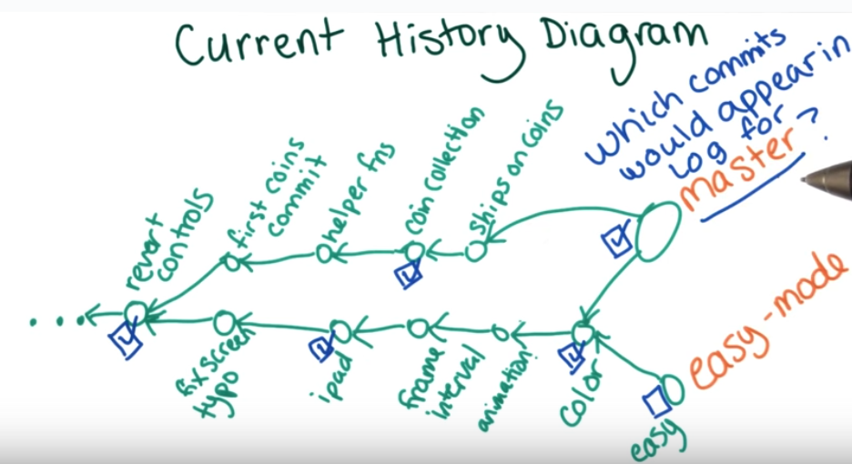
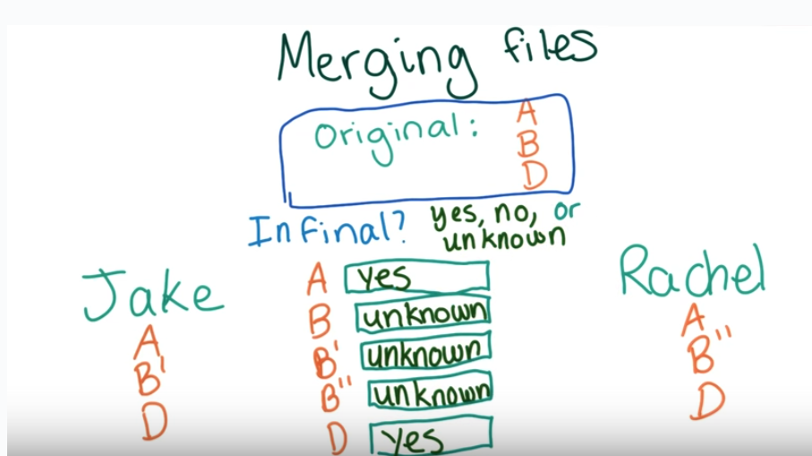
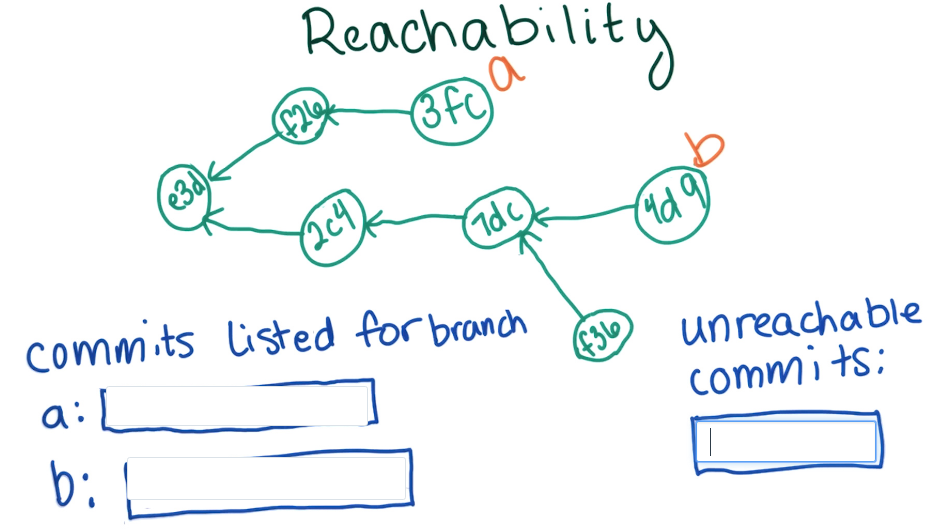
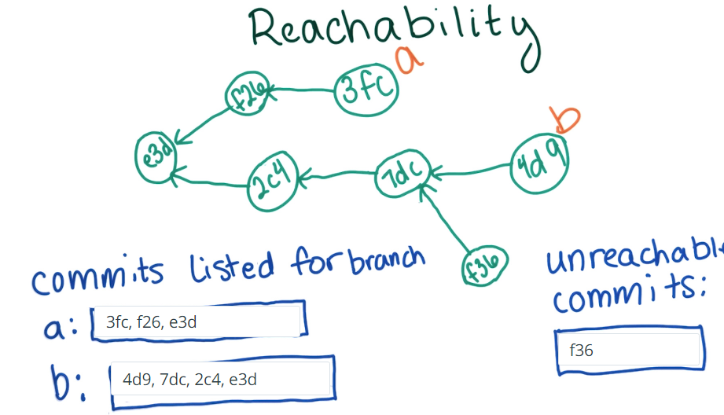

# Git and Github
##Most important things
* Concept of version control
* Process of build a git repository
    - git clone
    - git init
* Concept of working directory, staging area, commit and repository and their relationship
* The commands that enable the behavior on the above 4 concepts:
    - git add (working -> staging)
    - git commit (staging (take a snapshot of a commit) -> repositories)
    - git status (working, staging, tip of the branch)
    - git log (on commit and track back all the way to the source commit)
    - git diff (working, staging, last commit, commits, branches)
    - git show (commit, branch)
    - git reset
    - git checkout (commit, branch)
   
* Concept of branch (reference of commit), parent commit, reachibility and merge
    - git branch
* The commands that work on branch (they are actually work on commit because the branch is only a reference or alias of a certain commit)
    - git checkout
    - git merge (__only on branch not commit__)
* For my understanding, branch is actually a special commit, it is alway on the tip (the tip commit called HEAD)
    - in command like diff, log, show, checkout. Branch is just like commit.
    - in command commit, it always buid a new commit whose parent commit is the latest checkouted commit.

## compare files on windows and linux
**windows**
```bash
FC old.html new.html 
```

**linux**
```bash
diff -u old.html new.html
```
-u: unify output

## Version Control
**Any system that allows for systematic versioning of content**
**Make it easy to create, store and access different versions of the same**documents, code, recipes.
- manual saving
- Dropbox
- Google
- Wikipedia
- Git
- SVN

**commit**

## Git


### Git Errors and Warning Solution
__Should not be doing an octopus__
Octopus is a strategy Git uses to combine many different versions of code together. This message can appear if you try to use this strategy in an inappropriate situation.

__You are in 'detached HEAD' state__
HEAD is what Git calls the commit you are currently on. You can “detach” the HEAD by switching to a previous commit, which we’ll see in the next video. Despite what it sounds like, it’s actually not a bad thing to detach the HEAD. Git just warns you so that you’ll realize you’re doing it.

__Panic! (the 'impossible' happened)__
This is a real error message, but it’s not output by Git. Instead it’s output by GHC, the compiler for a programming language called Haskell. It’s reserved for particularly surprising errors!

### Git Commands
* git init
* git status
* git add
* git commit
* git log
    - git log _check out all commit_
    - git log --graph --oneline master coins _visualize the commits on master and coins branches_
* git diff
    - git diff old_commit_id new_commit_id  _add in new commit will be +_
    - git diff _compare working directory with staging area_
    - git diff --staged  _compare staging with the last commit_
        
* git reset
    - git reset --hard _overwrite working dictory or staging area by last commit, careful to use this command_
* git show 
    -git show commitID _see change compared with parent commit_
* git branch
    - git branch
    - git branch master
    - git branch -d coins
* git checkout
    - git checkout -b branchName
    - git chekcout branchName

* staging area
* working directory


### environment setup
* git config --global core.editor "sub -n -w" 
    - n means open a new window, w indicate a way to exit the edit mode
* git config --global push.default upstream
* git config --global merg.conflictstyle diff3 
* git config --global core.autocrlf true _reslove new character conflict(LF vs CRLF) on windows_


### Repositories
* store medadata about history of the repositories
    - .git
        + config
        + objects
        + 



working directory - staging area - Repository

### Branch
* Branch is actually a label for a commits
* Tip of branch is the lastest commit on a branch
* A single commit can have multiple branch labels
* Exmaples of using branch
    - _productive quality_ vs _experimental branch_
    - _people 1_ vs _people 2_
* Merging two branches
    - compare the both branch tip commits with root commit
    
    >__A note about git merge__
        git merge will also include the currently checked-out branch in the merged version. So if you have branch1 checked out, and you run git merge branch2 branch3, the merged version will combine branch1 as well as branch2 and branch3. That’s because the branch1 label will update after you make the merge commit, so it’s unlikely that you didn’t want the changes from branch1 included in the merge. For this reason, you should always checkout one of the two branches you’re planning on merging before doing the merge. Which one you should check out depends on which branch label you want to point to the new commit.

        >Since the checked-out branch is always included in the merge, you may have guessed that when you are merging two branches, you don't need to specify both of them as arguments to git merge on the command line. If you want to merge branch2 into branch1, you can simply git checkout branch1 and then type git merge branch2. The only reason to type git merge branch1 branch2 is if it helps you keep better mental track of which branches you are merging.

        >Also, since the two branches are merged, the order in which they are typed into the command line does not matter. The key is to remember that git merge always merges all the specified branches into the currently checked out branch, creating a new commit for that branch.
    * Merge Conflict
        

__Reachability__



### References

[Udacity Git Commit Message Style Guide](http://udacity.github.io/git-styleguide)


## Github

### git commnad about github
git remote
git remote -v 
git remote show origin
git push origin master
git pull origin master
git fetch

### push to github
git push origin master

### Pulling Changes
When local version is out of date with the remote Github version. 
__what is local and remote have conflict (usually caused by collaborators__
Merging remote changes
* when you clone a repository from a reomote repository
    - you get last known position of the branch on the remote(__there is hidden branch call origin in your repository, your can git log or git diff it, but you cant see it through git branch__)
* git pull origin master = git fetch origin + git merge master origin/master
* git status - one commit ahead
* git status - out of sync

### folk
fork other's repositories -> clone to local
1. github track how many people fork a repositories
2. fork basic is clone on cloud

### add collaborators
1. setting on github repositories page 
2. add collaborators

### fast-forward merges (when you can reach a from b, a is the ancest of b)
iIf there is no conflict, the pull will not generate new commit as the fetch and merge did. Because the new 

__fast-forward merges__
local: c3s <- sew <- qcq (master)
remote: c3s <- sew <- qcq <- efe (origin/master)
if we do the command <code>git pull master origin</code> them local will become,
local: c3s <- sew <- qcq <- efe (master)
just move the master label forward.

__fetch and merge__
local: c3s <- sew <- qcq <- w3o(master)
remote: c3s <- sew <- qcq <- efe (origin/master)
if we do the command <code>git pull master origin</code> them local will become,
local: c3s <- sew <- qcq <- w3o (master)         <- j9d
                        <-  efe (origin/master)

# Node.js 
### What is node.js 
* based on google chrome v8 javascript engine
* a runtime environment that let you run js on server side
* expose additional api that you normally do not have access to - interact with files

__feature__
* same language on server and front end
* though JS is a single thread language, it is event driven - non-blocking IO, 
* package manage - npm (node js package management)// like easy-install in python
* growing community, ecosystems

### js
__two ways to define functions__
* function key word - define at parse-time
thisWillWork()
function thisWillWork(){
    
}

* var key work - define at runtime
thisWillWork() // error, function haven't defined yet
var thisWontWork = function(){
    
}

__import package__
var qs = require('querystring');
var params = qs.parse('foo=0&bar=1')
__npm__
* you can have multiple version of same package
    - npm install -g package
* node version manager - nvm
* express
* request
* password


__event__
```javascript
var EventEmitter = require('event')
var e = new EventEmitter()
var x=0
e.on('addOne', function(){
    x++;
})


e.emmit('addOne')   //x=1
e.emmit('addOne')   //x=2
e.emmit('nope')   //do nothing, the event is not defined
```

### webcast notes
    Intro / What Is Node.js?

    Node.js is a runtime environment, based on Google Chrome’s V8 JavaScript engine, that allows you to write server-side applications in JavaScript. It’s a common misconception to call Node.js a “programming language”. Writing your server-side code with Node provides some benefits, such as:

    The same language on the client and server; you only need to know JavaScript to write for the full stack!
    Event-driven / asynchronous: Make your applications respond to changes in state and user interactions, and continue working while you wait for things to process (such as API requests, etc)
    Non-blocking I/O: Despite being single-threaded, Node.js can complete tasks concurrently. No need to wait for things to finish before moving on to something else.
    Huge & growing community: The Node community is new but large; there’s tons of support online, and NPM is a great ecosystem for managing packages.
    If you’re familiar with JavaScript, not much to see here! For those comfortable with Python, here are a bunch of examples:

    Hello, World!2
    Variables & Types2
    Arithmetic2
    Loops2
    Functions2
    Importing & Using Packages1
    More tutorials can be found at the end of this post! :slight_smile:

    The Ecosystem (npm, REPL, version managers, etc.)

    One of the nicest parts of the world of Node.js is the ecosystem and the tools surrounding it. Here’s a brief overview:

    NPM: Think of NPM as Python’s pip, but for Node.js. It’s a package management tool that lets you install packages at the system level (global) or per project (local). Using the package.json configuration file, you can specify metadata about your project as well as its dependencies. What’s nice about being able to have project-specific packages is that you might depend on two versions of the same package in different projects on your computer; without a tool like virtualenv, Python can’t handle a situation like this because pip installs everything globally.
    Side note: NPM has had a rough couple of weeks (leftpad controversy); a good lesson to be learned is to only require a dependency if:
    You absolutely need it!
    You’re sure it’s going to be maintained for the short to medium-term future
    The REPL: Just like Python, Node has a great REPL that you run by typing node into the command line. It works the same way; write a line, hit enter, and check the output. Not too much to explain here!
    Version Management: Those familiar with Ruby might have heard of version management tools like rvm and rbenv; they let you install and switch between multiple versions of the language on your computer. That’s awesome for the same reason as npm; different projects sometimes require different versions of things. In the Node world, the two most popular version managers are nvm and n; they both work well and are simple to set up.
    Popular Modules: There are lots of great packages you’ll find yourself installing in most projects; here are a few of the best:
    Express: lightweight and extensible web server
    Request1: HTTP client
    Async: Tools for working with asynchronous function calls (such as loops, etc)
    Passport: Authentication for lots of popular sites
    Underscore: collection of useful utilities that aren’t in the standard library
    Gulp: build tool
    PM2: process management system
    Chalk1: Add colors to terminal output
    The Community: The Node.js community is both large and growing; two great qualities to have. What that means is that there’s a multitude of tutorials, great packages, and support out there on the internet for you. It’s a good time to be a Node developer! Plus, with JavaScript being the de-facto language of the web, you can reference lots of the existing content on the web about it.
    Asynchronous Programming: Events & Callbacks

    JavaScript is all about events; something happens, and you use a callback function to respond to it when it does. It works that way because of the asynchronous nature of the web; you spend a lot of time waiting for things to happen, whether it’s a user doing something or an API call coming back to you. Here's an example!

    Helpful Links

    You might want to check these out:

    MDN: https://developer.mozilla.org/en-US/
    Repl.it: http://repl.it
    NPM: http://npmjs.com
    Express docs: http://expressjs.com
    Node school: http://nodeschool.io/2
    That's it! Comment below if you have any questions.

    Ty


